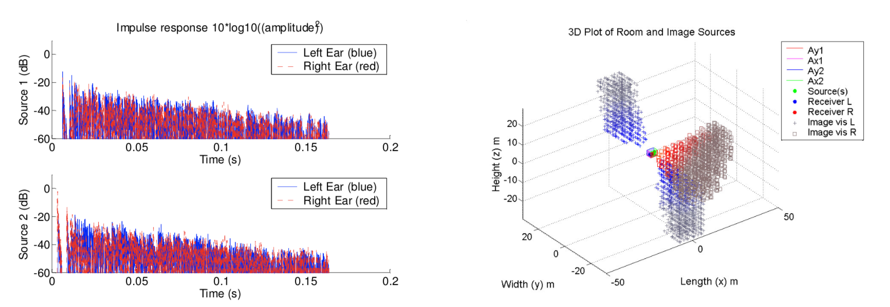

# PY_ROOMSIM
Python adaptation of Matlab sources with simulation of shoebox room acoustics

Link to original paper: [LINK](https://www.researchgate.net/publication/228970236_Roomsim_a_matlab_simulation_of_shoebox_room_acoustics_for_use_in_teaching_and_research)

A simulation of the acoustics of a simple rectangular prism room has been constructed using the MATLAB m-code programming language. The aim in creating the program Roomsim was to provide a signal generation tool for the speech and hearing research community, and a teaching tool for illustrating the image method of simulating room acoustics and some acoustical effects. The program is menu driven, has a user guide and example data files, and will be made freely available over the Internet under a GNU General Public Licence.

